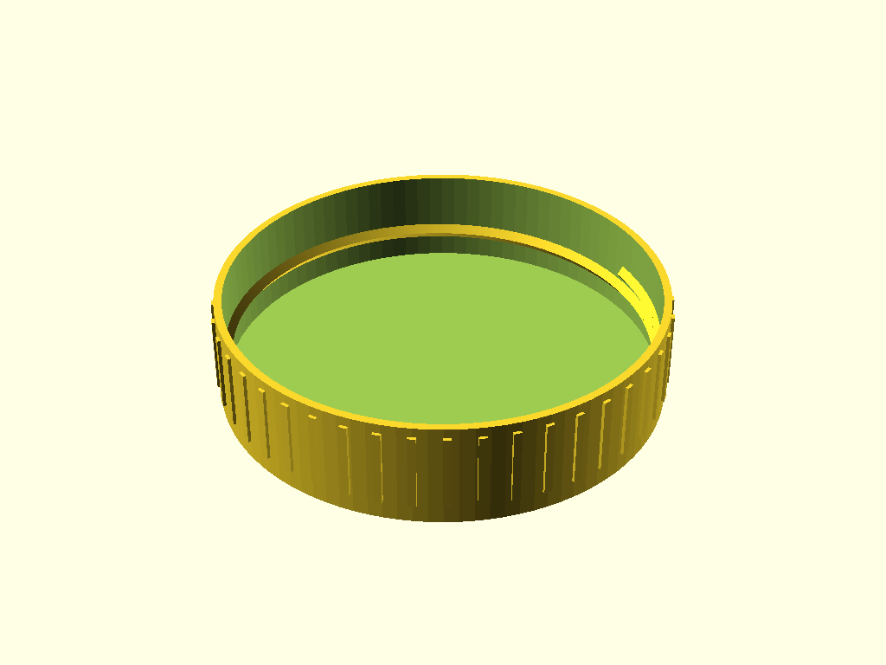
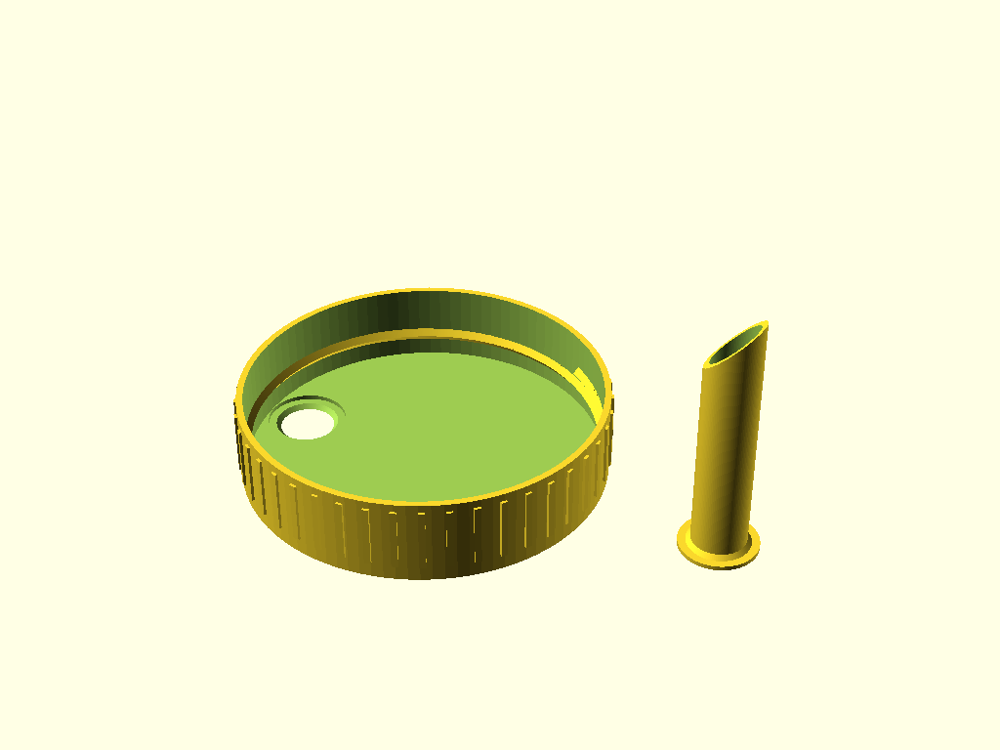

# Pindakaaspot Toolkit - Dutch (NL)

Pindakaaspot Toolkit biedt een  3D-print design voor op een grote Calve pindakaaspot (650 gram). 

Bijgeleverd zijn een ontwerp voor een deksel en een deksel met schenktuit.

De gemeten maten van deksel en pot zijn gedocumenteerd in deksel.scad. Het deksel draait stevig vast op de pot. 

## Deksel

## Deksel met tuit

De tuit kun je in de deksel lijmen.

## Handleiding
De SCAD files kun je met OpenSCAD renderen naar STL files.

## Disclaimer

De .scad bestanden van dit project zijn grotendeels door AI gegenereerd. 